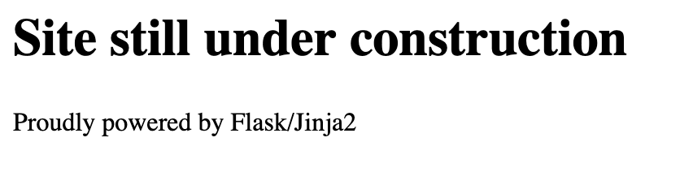

# Templated

For this challenge, we are given a web page which contains the following message: 



By playing with the URL we can see that the message `Proudly powered by Flask/Jinja2` changes in `The page '<something>' could not be found`, accordingly with how we feed the url. Now, three things must come in mind at this point:

1. This "feature" must be exploited somehow.
2. Jinja2 is a web template engine for the Python programming language. We may search on the internet for vulnerabilities.
3. As the name of the challenge suggest, we need to attack using **Server-Side Template Injection** (**SSTI**).


#### Server-Side Template Injection
A server-side template injection occurs when an attacker is able to use native template syntax to inject a malicious payload into a template, which is then executed server-side.

Template engines are designed to generate web pages by combining fixed templates with volatile data. Server-side template injection attacks can occur when user input is concatenated directly into a template, rather than passed in as data. This allows attackers to inject arbitrary template directives in order to manipulate the template engine, often enabling them to take complete control of the server.
[Source: [hacktricks](https://book.hacktricks.xyz/pentesting-web/ssti-server-side-template-injection)]

#### Payload
Point 2 is used to understand what is the underlying technology. In particular, we know that Jinja2 is a web template engine for python, so we will use python syntax to generate the following payload and executing `os` commands on the back end: 

```python
{{request.application.__globals__.__builtins__.__import__('os').popen('cat${IFS}flag.txt').read()}}
```

Once injected to the backend through the URL, the flag will appear in the home page.